# Simple Auth

Thư mục này chứa các ví dụ về xác thực cơ bản bằng Node.js.

## Cấu trúc thư mục
- `basic_auth.js`: Xác thực cơ bản bằng username/password.
- `cookie_auth.js`: Xác thực sử dụng cookie.
- `img/`: Thư mục chứa hình ảnh minh họa.
- `package.json`: Thông tin dự án và các package phụ thuộc.

## Cài đặt

1. Cài đặt Node.js (>=14).
2. Cài đặt các package phụ thuộc:

```powershell
npm install
```

## Sử dụng

### Chạy xác thực cơ bản
```powershell
node basic_auth.js
```

#### Các chức năng:
- Truy cập `http://localhost:3000/`  
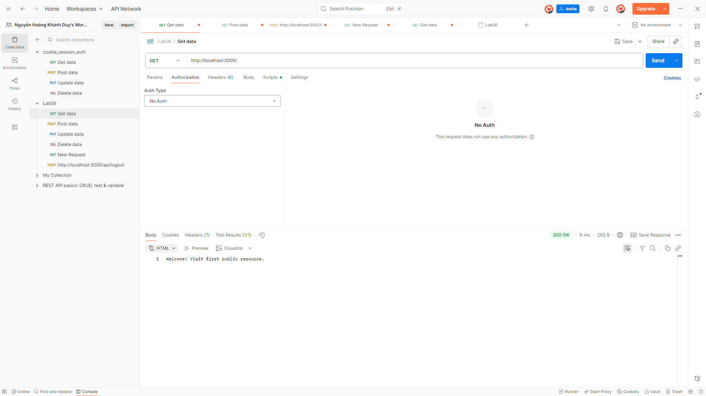
- Truy cập `http://localhost:3000/public`: Trang public, không cần đăng nhập.
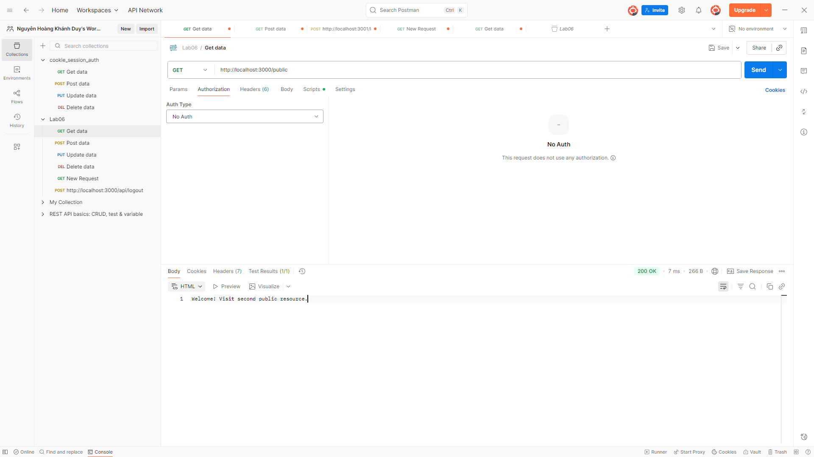
- Truy cập `http://localhost:3000/secure`: Yêu cầu xác thực Basic Auth.
  - Sử dụng header `Authorization: Basic <base64(username:password)>`.
  - Username mặc định: `admin`, Password: `12345`.
  - Nếu xác thực thành công sẽ nhận được thông báo truy cập thành công.
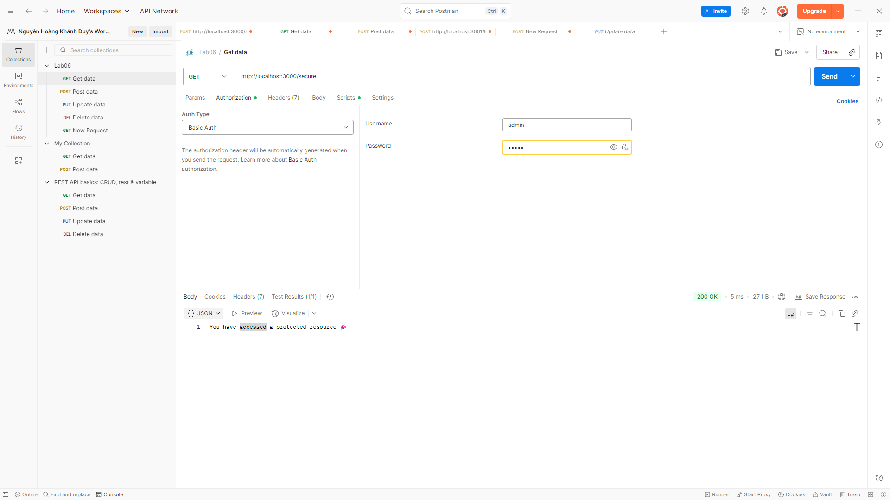
## Test lỗi

## Các lỗi được xử lý trong code

### basic_auth.js
- Truy cập `/secure` không có header Authorization:
  - Trả về: `401 Authentication required.`
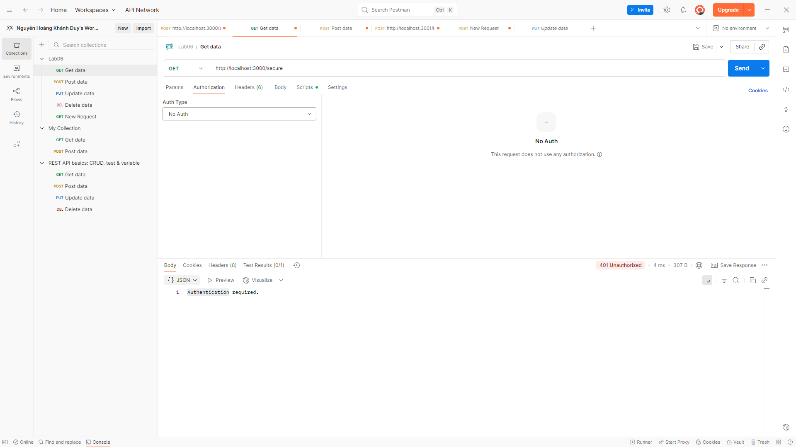

- Truy cập `/secure` với sai username/password:
  - Trả về: `403 Access denied.`
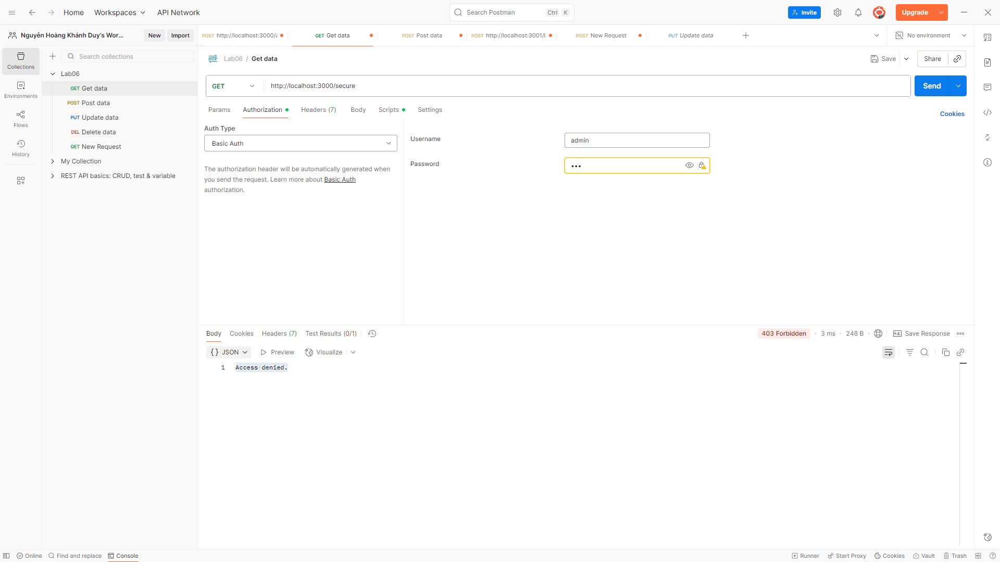


### Chạy xác thực bằng cookie
```powershell
node cookie_auth.js
```

#### Các chức năng:
- Đăng nhập: Gửi POST tới `http://localhost:3001/login` với JSON body `{ "username": "admin", "password": "12345" }`.
  - Nếu thành công sẽ nhận được cookie xác thực.
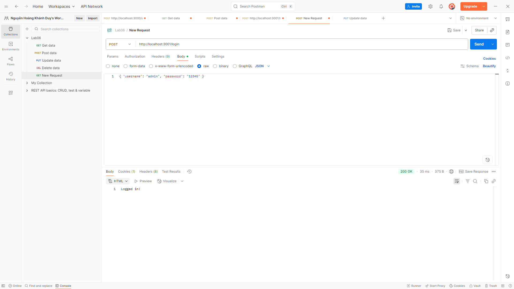
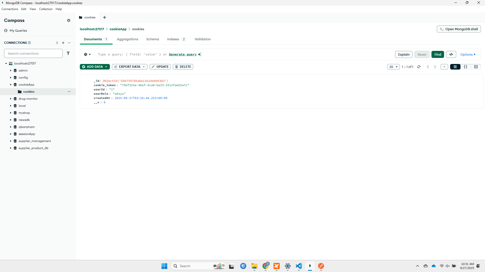
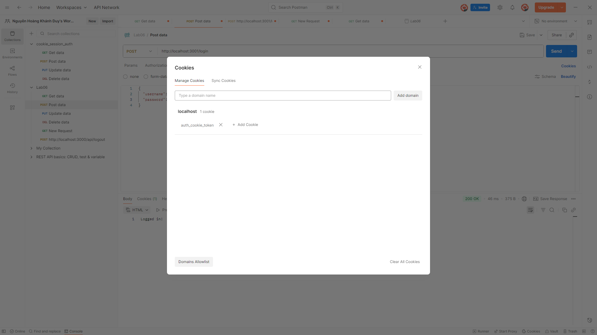

- Đăng nhập sai username/password:
  - Trả về: `401 Invalid credentials`
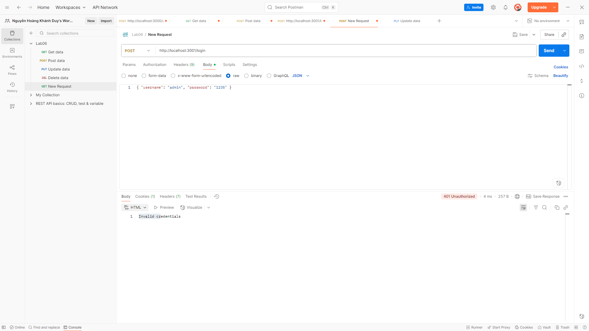

##
- Truy cập profile: Gửi GET tới `http://localhost:3001/profile` kèm cookie `auth_cookie_token`.
  - Nếu cookie hợp lệ sẽ nhận được thông tin người dùng.
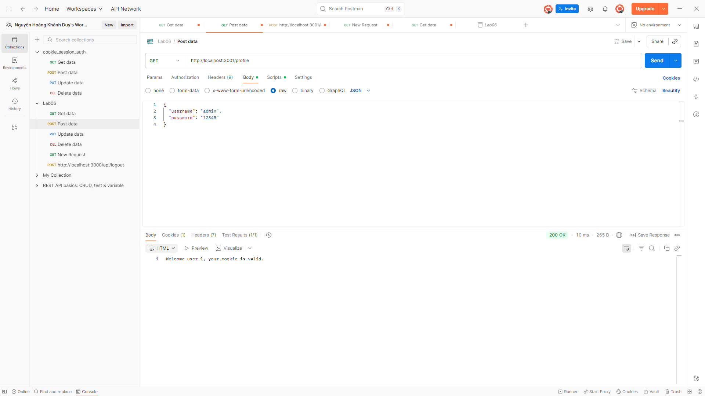
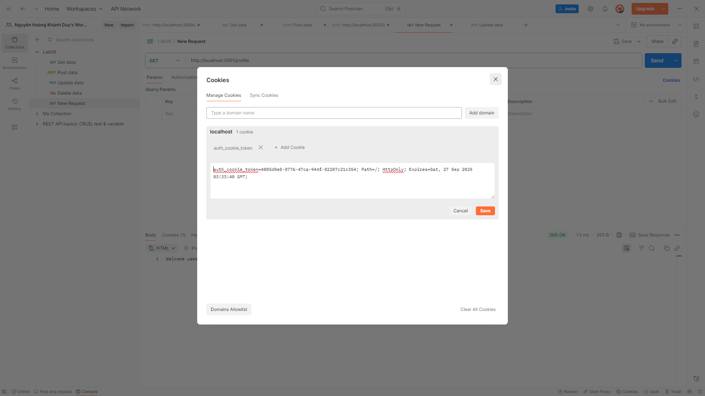

- Truy cập `/profile` không có cookie hoặc cookie không hợp lệ/hết hạn:
  - Trả về: `401 No cookie found` hoặc `401 Invalid or expired cookie`
  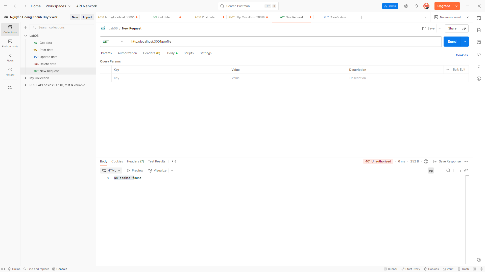

  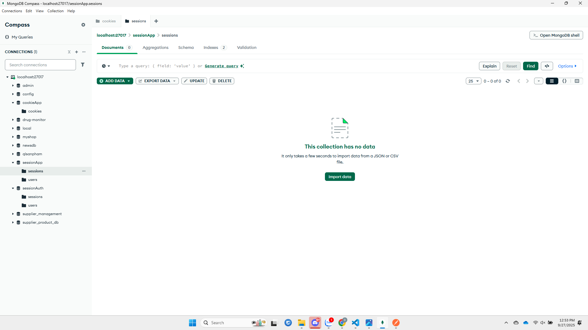
  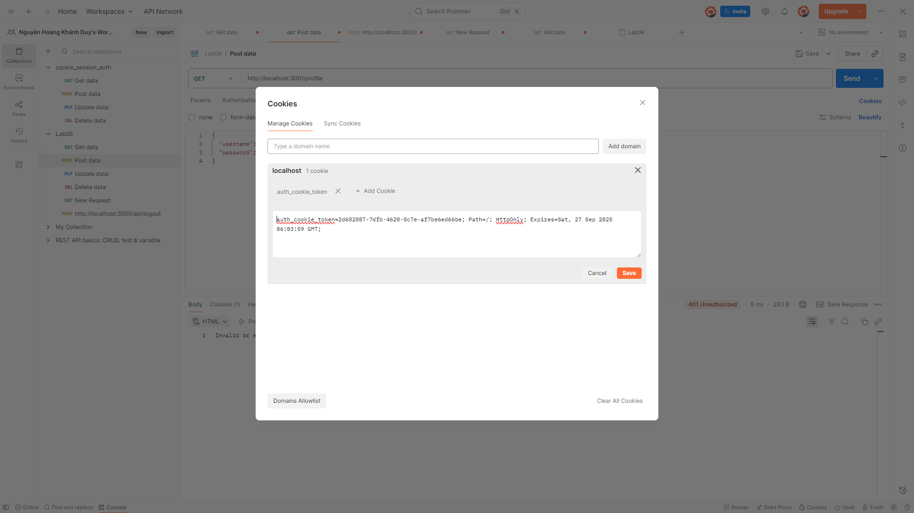
  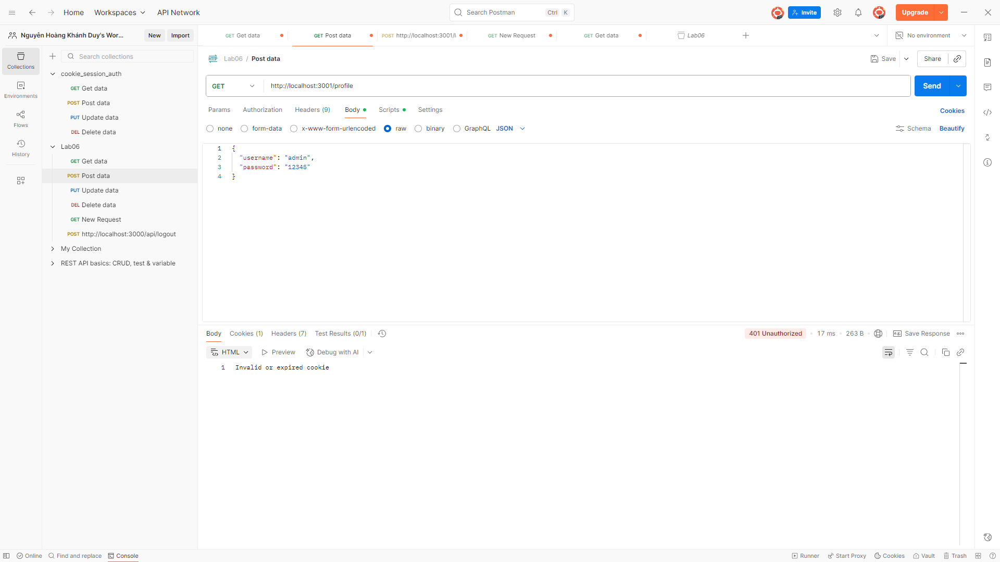

##
- Đăng xuất: Gửi POST tới `http://localhost:3001/logout` để xóa cookie xác thực.
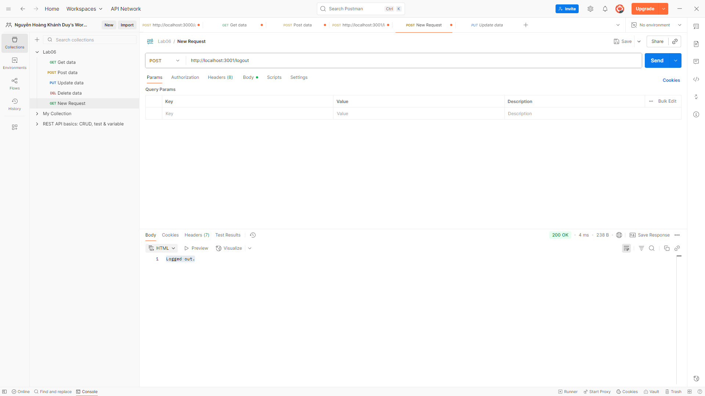
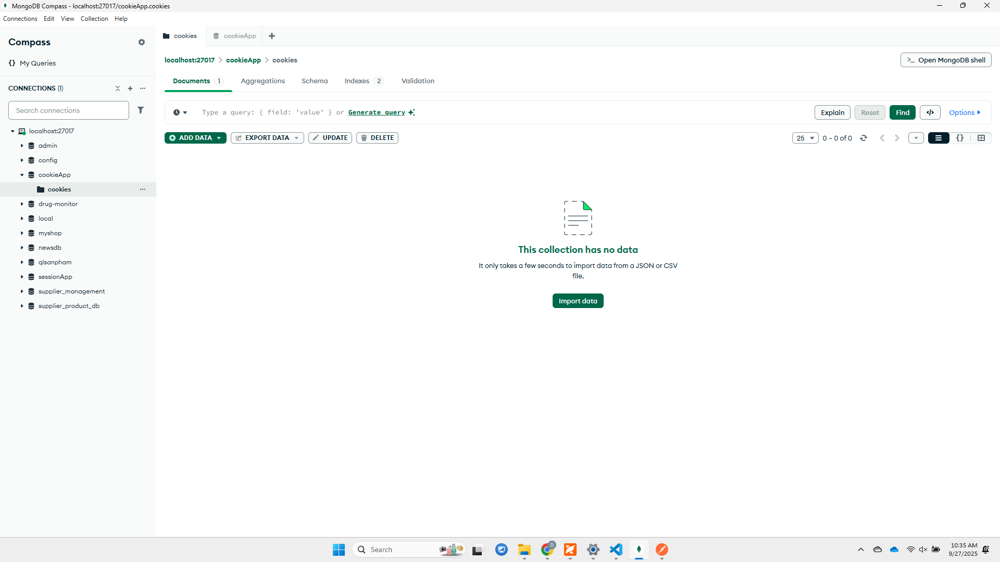
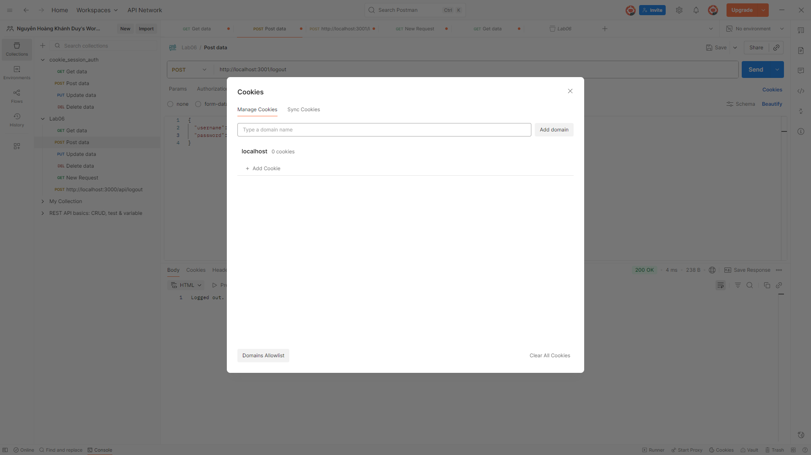

Các lỗi khác sẽ được trả về theo logic xử lý trong từng route.
